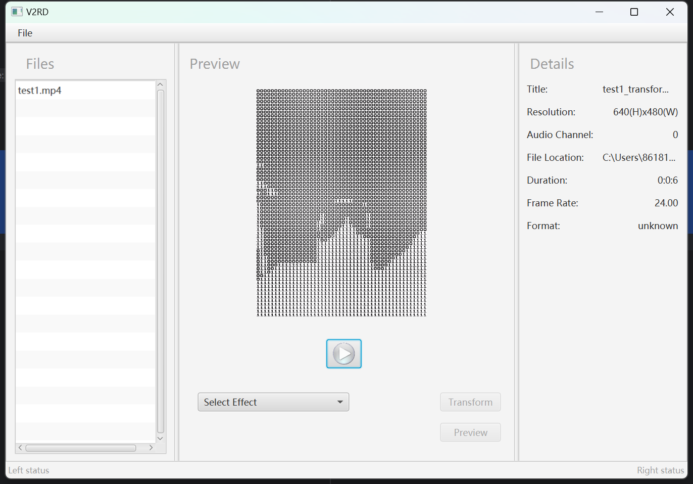
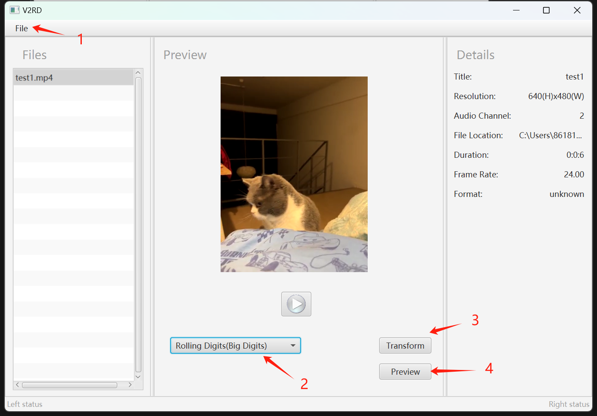

# V2RD

A tool that can transform mp4 videos into rolling digits.

# Introduction



In this project, the chosen design pattern is the **`Strategy`** pattern. All effect algorithms are managed by a class named **`Effect.java`**, allowing for seamless addition or removal of new effects.

The project comprises:

1. A Java unit test class dedicated to testing effect algorithms, known as **`UnitTest.java`**.
2. The main functionality encapsulated in a class named **`APP.java`**.
3. A controller module, **`APPController.java`**, responsible for overseeing all interaction logic within the user interface (UI).

# Prerequisite

- A C++ running environment(Visual Studio C++ extension is recommended)
- [OpenCV(4.4.0)](https://opencv.org/releases/) should be installed in case some libraries not found
- Some mp4 videos to play with, there’s already a test file under project root path called `test1.mp4`

# Use

To play with this application, follow these steps:

To run the Java code from the command line, you can use the following command or run in an IDE:

- Run command below or use an IDE:

```bash
java -cp <path-to-this-project> com.example.v2rd2.APP
```

- Open an MP4 file: Upon opening a file, it is displayed within the Preview board.
- Select a video effect: Choose from the available video effects.
- Click on the Transform button: Initiates the transformation process, displaying a pop-up window indicating the progress.
- Upon completion, the Preview button becomes clickable. Click on it to preview the transformed video with the selected effect.

